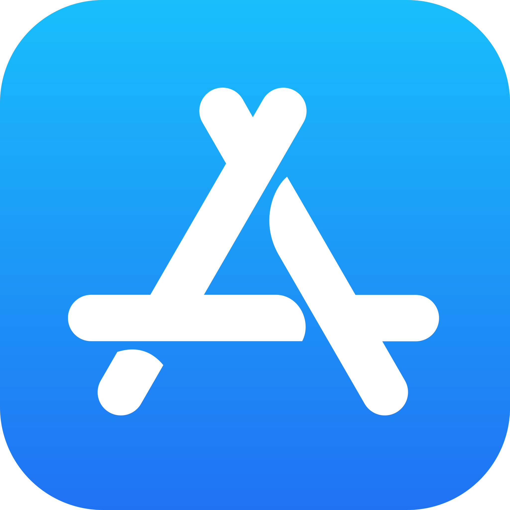
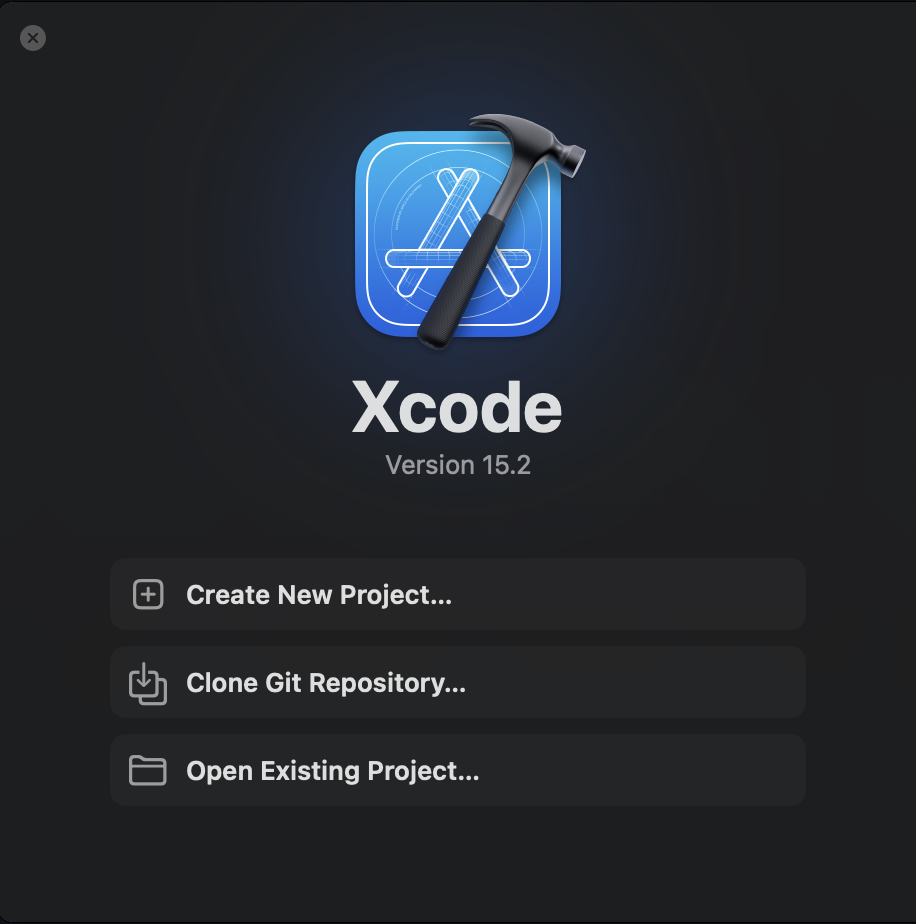
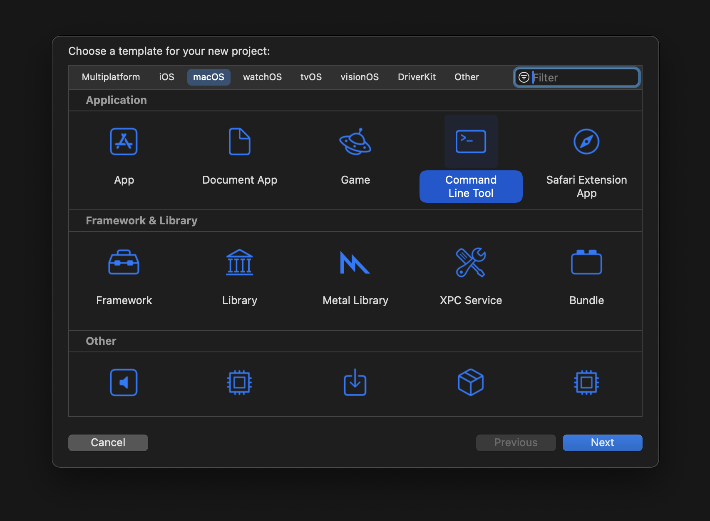

# Setting up Xcode on macOS

1. Click on the AppStore icon in your Dock or find it through the Spotlight Search
   
<h1> AppStore</h1>

> [!TIP]
> Use shortcut for Spotlight Search: 'command + space'
2. In the search bar in AppStore type 'Xcode'

<h1> Xcode</h1>

3. Click on the 'get' and 'install' buttons to download the app. You may need to enter your Apple ID password
4. The first time you open Xcode, you will need to agree to the license agreement and install any additional components that Xcode needs
5. After you properly installed the IDE, you will see 3 options:

  
7. Hit 'Create New Project'
8. To start coding in C, you have to choose a proper template for your project.
    
   For that, you want to choose macOS -> Command Line Tool -> Next

<h1></h1>
   
